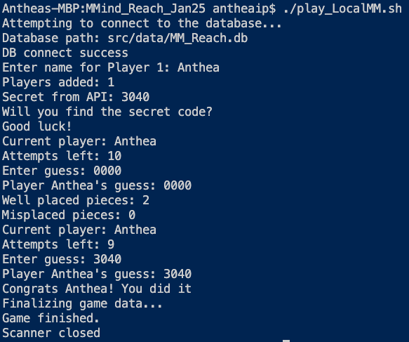
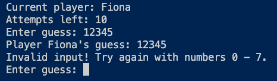
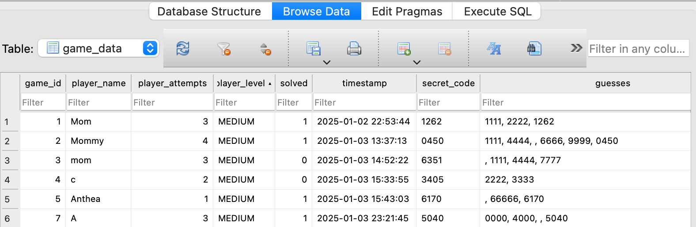
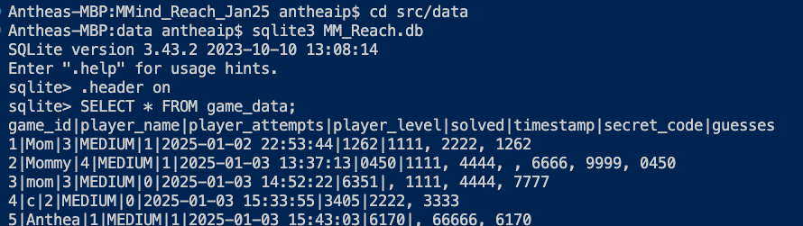
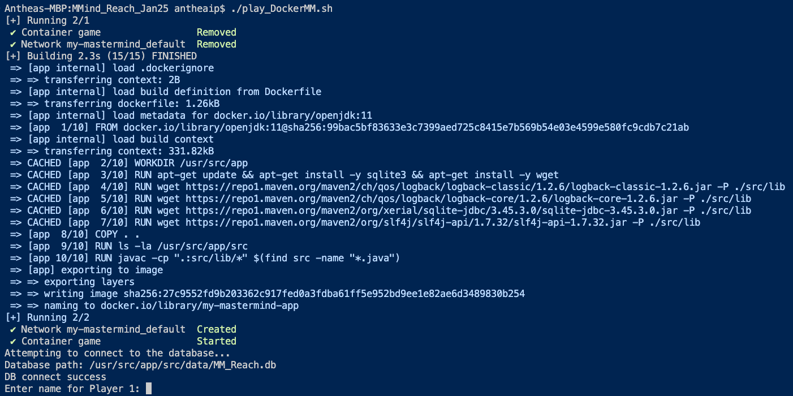
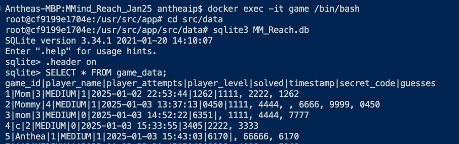
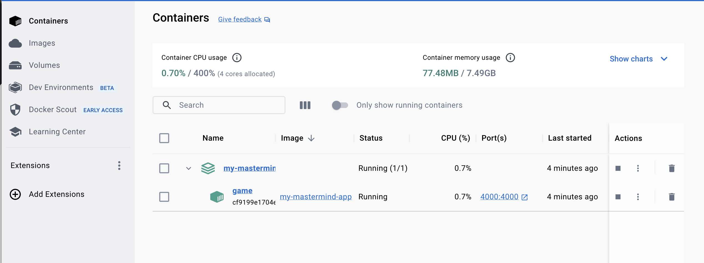
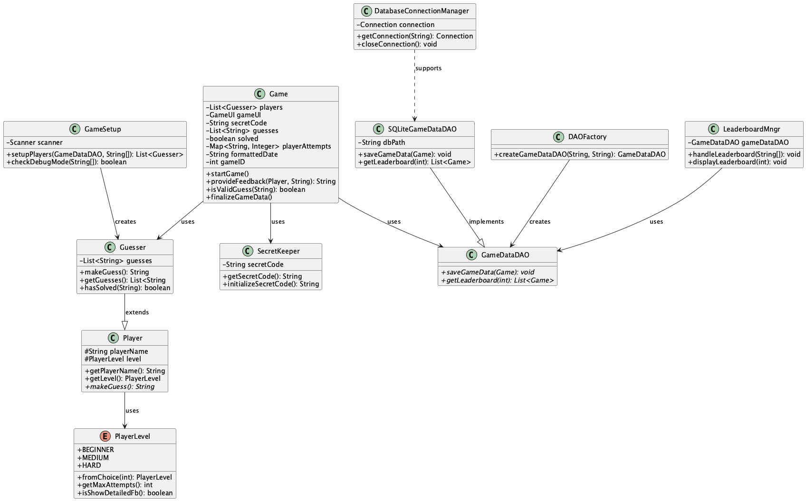

# Welcome to My Mastermind in Java
## Overview
This project implementats the classic Mastermind number guessing game. The user plays against the program. Read more about it here: 
* https://en.wikipedia.org/wiki/Mastermind_(board_game)

Key features include:
- Developed in Java, adhering to Object-Oriented Programming (OOP) and (mostly) SOLID principles.
- Stores game data, including player names, rounds, results, timestamps, secret codes, and guess histories, in an SQLite database.
- Docker-enabled for cross-platform compatibility and ease of use.

## Game Rules
The goal of Mastermind is to guess the secret code composed of four distinct pieces, each ranging from 0 to 7. After each guess, feedback is provided:

- Correctly placed pieces: Numbers in the correct position.
- Misplaced pieces: Numbers that are correct but in the wrong position.
  
The user has 10 attempts by default (configurable) to guess the secret code.


## Installation and Operation
The game can be played through a command line interface (locally), or through a Docker container (requires Docker Desktop). The addition of Docker should allow a user to run my application on any system that supports Docker.


#### Requirements
1. Java: 
- To check if you have it installed, in the terminal:</br>


```
java -version
```
- If not installed, you can install here: https://www.java.com/en/

2. Docker Desktop: 
- This application manages containerization. To check if Docker is installed, in the terminal:
```
docker --version
```
- If not installed, you can download it here: https://www.docker.com/get-started/

#### Installation:
1. Clone the repository:
```
git clone https://github.com/aip956/Reach_Jan25
```

2. Navigate to the project directory:
```
cd MM_Reach_Jan25
```
</br>

### Running the Game
#### Local Execution

1. Enable the script (1st time): </br>
```
chmod +x ./play_LocalMM.sh
```

2. Run: </br>
```
./play_LocalMM.sh
```
#### Docker Execution
1. Start Docker Desktop
2. Make the script executable (1st time only)
```
chmod +x ./play_DockerMM.sh
```
3. Build and run the container
```
./play_DockerMM.sh
```


### View data locally:
1. Navigate to database directoryGame data is stored in an SQLite database. To view:
```
cd src/data
```

2. Open the SQL shell
```
sqlite3 MM_Reach.db
```

3. View the game data (Optional: Turn on headers)
```
.header on
SELECT * FROM game_data;
```
4. Exit the sql shell
```
.exit
```

### View Data in Docker:
1. Start game again, but don't play. Open another terminal and enter the bash shell:
```
docker exec -it game /bin/bash
```    
2. Navigate to the data dir and open the SQLite shell. Turn header view on, and view the data:
```
cd src/data
sqlite3 MM_Reach.db
.header on
SELECT * FROM game_data;

```
Exit the SQLite shell:
```
.exit
```

Exit the container's shell:
```
.exit
```

</br>
</br>

## Design
### Key Design Features
1. Object-Oriented Design
- The game is structured using classes that encapsulate the core logic and interactions
- Separation of concerns is maintained with packages like Models, View, DAO, DBConnectionManager.

2. Factory Pattern
- A factory design pattern is implemented in the DAOFactory class to create the appropriate GameDataDAO (e.g. SQLite). This design supports extendibility, enabling easy addition of other databases (e.g. MySQL).

3. Database Integration:
- Game data is stored persistently in an SQLite database using a GameDataDAO interface and its SQLiteGameDataDAO implementation.

4. Docker Integration:
- A Dockerfile defines the environment and dependencies
- A docker-compose.yaml simplifies starting, stopping, and rebuilding the application.


## Screen Captures

</br>

#### Run and play the game locally using the command line:</br> 


</br>

#### Wrong input entered!</br> 
 
</br>

#### Viewing data in DB Browser:</br> 

</br>

#### Viewing data in the terminal</br> 

</br>
</br>

### Running in Docker:
#### Build and Run Container:</br>


</br>

#### Playing in Docker:
- After building the container, game play is the same as running locally 
</br>

#### View Docker Data:</br> 

</br>

#### Docker Desktop, Container:</br> 

</br>


#### Unified Modeling Language Diagram



## Future improvements

1. Database Enhancements:
- Explore additional database backends like MySQL or PostgreSQL for scalability
- Implement methods for retrieving games by various criteria (e.g. player or solved status)
  
2. Automated Testing
- Add JUnit tests for core components, including models, game logic, and DAO implementations.

3. Debug Mode:
- Add a command-line flag for debugging the secret code at the beginning of the game.
